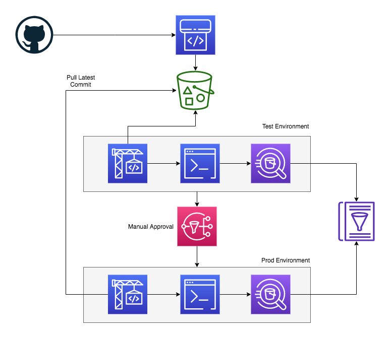

# CodePipeline Athena Execution Engine!

This project creates a pipeline to execute Athena DDL for table creation in the AWS Glue Data Catalog

A Github webhook triggers AWS CodePipeline to get latest information from tables folder in repository and create table metadata for each environment listed. This requires the Github webhook auth to reside in SecretsManager under the `gitTokenPath` property in a `password` attribute in the json doc.

The CodePipeline executes a CodeBuild project for each environment with a manual approval step between each environment to proceed. Each CodeBuild project runs the `scripts/deploy.sh` script and compares the `Table.Parameters.transient_lastDdlTime` timestamp in the Glue Data Catalog table against the `git log` last commit timestamp from the repository and runs the DDL scripts in order for each table under the `tables` directory.

## Getting Started
To get started modify the properties in the `bin/codepiepline-athena-ddl.ts` file and run `cdk deploy` to launch the resources into your account.

This example contains sample IoT data in the `data/sensors` folder that is partitioned by YYYYMMDDhh. This data gets uploaded to the S3 bucket of each environment to show how the Athena DDL gets applied in the Glue Catalog to make the data ready to be queried. This demo also uses the LakeFormation permissioning model to register the S3 buckets as Data Locations and apply permissions to the CodeBuild Role used to create tables.